# Teletraan Market Analyzer - System Architecture

**AI-Powered Market Intelligence Platform** | FastAPI + Next.js 16 + Claude Agent SDK

---

## 1. System Overview

Teletraan is a full-stack market analysis platform that discovers investment opportunities autonomously using an LLM-driven multi-agent system. The system autonomously scans macro conditions, analyzes market heatmaps, runs parallel specialist analysts, and synthesizes actionable investment insights -- all without requiring user-provided stock symbols.


---

## 2. Backend Architecture

### 2.1 FastAPI Application Structure

**File: `backend/main.py`**

The application lifecycle:

```
Startup:
  1. Configure structured logging (stdout, reduced uvicorn noise)
  2. init_db() -- create SQLite tables via Base.metadata.create_all
  3. _cleanup_stale_analysis_tasks() -- mark in-progress tasks as FAILED
  4. etl_orchestrator.start() -- begin 7 cron jobs

Shutdown:
  1. etl_orchestrator.stop()
  2. close_db() -- dispose engine connections
```

**CORS**: Allows any `http://localhost:<port>` or `http://127.0.0.1:<port>` origin.

**API prefix**: All routes under `/api/v1/*` via `settings.API_V1_PREFIX`.

### 2.2 Singleton Factory Pattern

All major components use lazy module-level singletons:

```python
_instance: SomeClass | None = None

def get_something() -> SomeClass:
    global _instance
    if _instance is None:
        _instance = SomeClass()
    return _instance

something = get_something()  # Convenience alias
```

Singletons in the codebase:
- `get_deep_analysis_engine()` -> `DeepAnalysisEngine`
- `get_autonomous_engine()` -> `AutonomousDeepEngine`
- `get_market_agent()` -> `MarketAnalysisAgent`
- `get_heatmap_fetcher()` -> `HeatmapFetcher`
- `market_context_builder` -> `MarketContextBuilder`
- `etl_orchestrator` -> `ETLOrchestrator`

### 2.3 Exception Handling

```python
# Custom exceptions in api/exceptions.py
NotFoundError   -> 404 JSON response
ValidationError -> 400 JSON response
DataSourceError -> 503 JSON response

# Generic catch-all
Exception       -> 500, detail shown only if DEBUG=True
```

---

## 3. Analysis Pipeline: Heatmap-Driven Discovery

The **AutonomousDeepEngine** (`backend/analysis/autonomous_engine.py`) orchestrates a 6-phase pipeline that discovers investment opportunities without requiring user-provided symbols.


### 3.1 Phase 1: MacroScanner

**File: `backend/analysis/agents/macro_scanner.py`**

Queries Claude to identify the current macro environment.

**Output: `MacroScanResult`**
- `market_regime: str` -- "bull", "bear", "sideways"
- `regime_confidence: float` -- 0.0 to 1.0
- `themes: list[Theme]` -- each has name, direction, rationale
- `key_risks: list[Risk]` -- geopolitical, policy, recession risks
- `actionable_implications` -- risk_posture, positioning guidance

### 3.2 Phase 2: HeatmapFetch

**File: `backend/analysis/agents/heatmap_fetcher.py`**

Fetches real-time market data from Yahoo Finance for all S&P 500 constituents and sector ETFs.

**Output: `HeatmapData`** (defined in `heatmap_interfaces.py`)
- `sectors: list[SectorHeatmapEntry]` -- per-sector: name, etf, change_1d/5d/20d, breadth, top_gainers, top_losers, stock_count
- `stocks: list[StockHeatmapEntry]` -- per-stock: symbol, sector, price, change_1d/5d/20d, volume_ratio, market_cap
- `timestamp: datetime`
- `market_status: str`

Helper methods on HeatmapData:
- `get_sector_stocks(sector_name)` -- filter stocks by sector
- `get_outliers(change_field, threshold_std)` -- statistical outliers
- `get_divergences()` -- stocks diverging from their sector direction

### 3.3 Phase 3: HeatmapAnalysis (LLM)

**File: `backend/analysis/agents/heatmap_analyzer.py`**

Prompts Claude with formatted heatmap data + macro context to:
1. Identify market patterns (sector rotation, breadth divergences, momentum clusters)
2. Select 10-15 stocks for deep dive based on macro alignment, technical strength, opportunity type
3. Classify each selection: momentum, mean_reversion, breakout, divergence, catalyst, sector_leader

**Output: `HeatmapAnalysis`**
- `overview: str` -- summary of heatmap state
- `patterns: list[HeatmapPattern]` -- description, sectors, implication
- `selected_stocks: list[HeatmapStockSelection]` -- symbol, sector, reason, opportunity_type, priority, expected_insight_value
- `sectors_to_watch: list[str]`
- `confidence: float`

### 3.4 Phase 4: Deep Dive Analysis

**File: `backend/analysis/autonomous_engine.py` -> `_run_analysts_for_symbol()`**

Runs 5 specialist analysts **in parallel** for each selected stock:

```python
tasks = [
    self._run_single_analyst("technical", ...),
    self._run_single_analyst("sector", ...),
    self._run_single_analyst("macro", ...),
    self._run_single_analyst("correlation", ...),
    self._run_single_analyst("risk", ...),
]
results = await asyncio.gather(*tasks, return_exceptions=True)
```

Each analyst runs under a **semaphore** (`MAX_CONCURRENT_LLM = 3`). With 5 analysts queued, at most 3 run simultaneously; the remaining 2 wait for a slot.

Each analyst has **max_retries = 2** with 1-second backoff between attempts.

#### The 5 Specialist Analysts

| Analyst | File | Key Outputs |
|---------|------|-------------|
| **Technical Analyst** | `technical_analyst.py` | RSI, MACD, Bollinger Bands, support/resistance, pattern signals, confidence |
| **Sector Strategist** | `sector_strategist.py` | Sector rankings, rotation signals, relative strength, market phase |
| **Macro Economist** | `macro_economist.py` | Regime classification, yield curve analysis, Fed outlook, market implications |
| **Correlation Detective** | `correlation_detective.py` | Cross-asset divergences, lead-lag signals, historical analogs, correlation shifts |
| **Risk Analyst** | `risk_analyst.py` | Volatility regime, risk assessments, tail risks, position sizing guidance |

All analysts follow the **Prompt/Parse pattern**:
```python
ANALYST_PROMPT = "..."           # System prompt constant
format_context(data) -> str      # Build user prompt from market data
parse_response(text) -> Result   # Parse LLM output to typed object
```

### 3.5 Phase 4.5: Coverage Evaluation (Adaptive Loop)

**File: `backend/analysis/agents/coverage_evaluator.py`**


**Output: `CoverageEvaluation`** (max 2 iterations)
- `is_sufficient: bool`
- `gaps: list[CoverageGap]` -- description, suggested_sectors, suggested_stocks, importance
- `additional_stocks_recommended: list[HeatmapStockSelection]`
- `reasoning: str`
- `can_iterate: bool` -- property: `not is_sufficient and iteration_number < MAX_ITERATIONS`

### 3.6 Phase 5: Synthesis Lead

**File: `backend/analysis/agents/synthesis_lead.py`**

Aggregates all analyst reports with institutional memory:

```
Inputs:
  - All analyst reports (per symbol, all 5 analysts)
  - Macro context + heatmap analysis
  - Institutional memory: pattern success rates, historical track record
  - Pattern context from InstitutionalMemoryService

Processing:
  1. Cross-validate signals (multi-analyst agreement = higher confidence)
  2. Weight by macro alignment and heatmap pattern confirmation
  3. Rank opportunities by confidence * fit * risk/reward
  4. Generate 3-5 final DeepInsight recommendations

Output: List[dict] -> stored as DeepInsight records
  - title, thesis, primary_symbol, action (STRONG_BUY/BUY/HOLD/SELL/STRONG_SELL/WATCH)
  - confidence, time_horizon, risk_factors
  - supporting_evidence (from analysts)
  - invalidation_trigger, historical_precedent
  - entry_zone, target_price, stop_loss, timeframe
```

### 3.7 Legacy Fallback Pipeline

If HeatmapFetch fails, the engine falls back to:
```
Phase 1: MacroScan (same)
Phase 2: SectorRotation (legacy) -- LLM-based sector rotation analysis
Phase 3: OpportunityHunt (legacy) -- screen 110 hardcoded stocks + LLM ranking
Phase 4: DeepDive (same 5 analysts)
Phase 5: Synthesis (same)
```

---

## 4. Multi-Agent Deep Dive Engine

**File: `backend/analysis/deep_engine.py`**

For **user-provided symbols** (as opposed to autonomous discovery), the `DeepAnalysisEngine` runs a simpler flow:


### Key Differences from Autonomous Pipeline

| Feature | DeepAnalysisEngine | AutonomousDeepEngine |
|---------|-------------------|----------------------|
| Stock selection | User provides symbols | Automatic via heatmap |
| Phases | 2 (analysts + synthesis) | 6 (macro through synthesis) |
| Context | Market context builder | Heatmap + macro context |
| Research storage | InsightResearchContext with full analyst reports | Insights only |
| Outcome tracking | Automatic for directional actions | Automatic for directional actions |

### Enhanced Context Preparation

Before running analysts, the engine prepares enhanced context:
- **Statistical features**: Pre-computed momentum, z-scores, volatility from `StatisticalFeatureCalculator`
- **Pattern matching**: Historical patterns from `InstitutionalMemoryService` matching current conditions
- **Track record**: Success rates of prior insight predictions

### Outcome Tracking

After insights are stored, `InsightOutcomeTracker` starts monitoring:
```python
action_to_direction = {
    "BUY": "bullish", "STRONG_BUY": "bullish",
    "SELL": "bearish", "STRONG_SELL": "bearish",
    "SHORT": "bearish", "COVER": "bullish",
    "ACCUMULATE": "bullish", "REDUCE": "bearish",
}
# Tracks for 20 trading days, evaluates on completion
```

---

## 5. Chat Agent Architecture

**File: `backend/llm/market_agent.py`**

Real-time conversational AI with tool calling, powered by Claude Agent SDK + MCP (Model Context Protocol).

### 10 MCP Tools

| Tool | Description | Parameters |
|------|-------------|------------|
| `get_stock_data` | Current price, change, volume, sector, market cap | `symbol: str` |
| `get_price_history` | Historical OHLCV data for trend analysis | `symbol: str, period: str` |
| `analyze_technical` | RSI, MACD, Bollinger Bands, moving averages, signals | `symbol: str` |
| `get_sector_performance` | All sector returns + relative strength | (none) |
| `analyze_sector_rotation` | Rotation signals, leading/lagging sectors, risk-on/off | (none) |
| `detect_patterns` | Chart patterns, breakouts, golden/death cross | `symbol: str` |
| `detect_anomalies` | Volume spikes, gaps, volatility surges | `symbol: str` |
| `get_economic_indicators` | GDP, unemployment, CPI, Fed Funds, VIX, consumer sentiment | (none) |
| `get_yield_curve` | Treasury yields 1mo-30yr | (none) |
| `compare_stocks` | Multi-stock metric comparison | `symbols: list` |

### Tool Registration Pattern

```python
@tool(name, description, params)
async def tool_handler(args: dict) -> dict:
    from llm.tools.handlers import actual_handler  # Lazy import
    result = await actual_handler(**args)
    return {"content": [{"type": "text", "text": json.dumps(result, indent=2)}]}

# All tools registered into a single MCP server
_market_tools_server = create_sdk_mcp_server(
    name="market-analyzer",
    version="1.0.0",
    tools=[...all 10 tools...],
)
```

### WebSocket Chat Flow


**Conversation History**: Maintained in-memory as `list[dict]` (role + content). Cleared on `clear_history()`. Multi-turn context is built by prepending history to each prompt.

**Max tool iterations**: 10 (prevents infinite tool loops).

---

## 6. Data Layer

### 6.1 Database Configuration

**File: `backend/database.py`**

```python
engine = create_async_engine(
    "sqlite+aiosqlite:///./data/market-analyzer.db",
    echo=settings.DEBUG,
)

async_session_factory = async_sessionmaker(
    engine, class_=AsyncSession, expire_on_commit=False,
)

class Base(DeclarativeBase): pass

# Table creation on startup
async def init_db():
    async with engine.begin() as conn:
        await conn.run_sync(Base.metadata.create_all)
```

### 6.2 TimestampMixin

**File: `backend/models/base.py`**

```python
class TimestampMixin:
    created_at: Mapped[datetime] = mapped_column(default=func.now(), server_default=func.now())
    updated_at: Mapped[datetime] = mapped_column(default=func.now(), server_default=func.now(), onupdate=func.now())
```

All models inherit from both `TimestampMixin` and `Base`.

### 6.3 Complete ER Diagram


### 6.4 Key Table Details

**Stock** (`stocks`) -- Core entity for tracked securities. Relationships to PriceHistory, TechnicalIndicator, Insight. Indexed on symbol (unique), sector, is_active.

**PriceHistory** (`price_history`) -- OHLCV data per stock per day. Unique constraint on (stock_id, date). Upserted via SQLite `INSERT OR REPLACE`.

**DeepInsight** (`deep_insights`) -- AI-synthesized multi-analyst insights. Enums: `InsightType` (opportunity, risk, rotation, macro, divergence, correlation) and `InsightAction` (STRONG_BUY, BUY, HOLD, SELL, STRONG_SELL, WATCH). Self-referential for parent/child insights. Includes trading levels: entry_zone, target_price, stop_loss.

**InsightResearchContext** (`insight_research_contexts`) -- 1:1 with DeepInsight. Stores full analyst reports (JSON), synthesis response, market snapshots, analysts_summary for context window management, estimated_token_count for cost tracking.

**InsightOutcome** (`insight_outcomes`) -- 1:1 with DeepInsight. Tracks prediction accuracy over 20 trading days. `OutcomeCategory`: STRONG_SUCCESS (>10%), SUCCESS (5-10%), PARTIAL_SUCCESS (1-5%), NEUTRAL, PARTIAL_FAILURE, FAILURE, STRONG_FAILURE. `TrackingStatus`: PENDING, TRACKING, COMPLETED, INVALIDATED.

**AnalysisTask** (`analysis_tasks`) -- Tracks autonomous analysis progress. Status enum includes both heatmap pipeline phases (HEATMAP_FETCH, HEATMAP_ANALYSIS, COVERAGE_EVALUATION) and legacy phases (SECTOR_ROTATION, OPPORTUNITY_HUNT). Progress 0-100 maps to phase progression.

**InsightConversation** + **Messages** + **Modifications** + **FollowUpResearch** -- AI-augmented conversation system for exploring insights. Supports threaded replies, modification audit trails (with PENDING/APPROVED/REJECTED workflow), and spawning follow-up research (SCENARIO_ANALYSIS, DEEP_DIVE, CORRELATION_CHECK, WHAT_IF).

**KnowledgePattern** (`knowledge_patterns`) -- Validated market patterns discovered from conversations. Types: TECHNICAL_SETUP, MACRO_CORRELATION, SECTOR_ROTATION, EARNINGS_PATTERN, SEASONALITY, CROSS_ASSET. Tracks occurrences, success_rate, avg_return_when_triggered. Used by InstitutionalMemoryService to enrich future analysis.

**ConversationTheme** (`conversation_themes`) -- Recurring themes across conversations with time-based relevance decay. Types: MARKET_REGIME, SECTOR_TREND, MACRO_THEME, FACTOR_ROTATION, RISK_CONCERN, OPPORTUNITY_THESIS. Decay rate default: 0.95 (5% daily). Deactivated when relevance < 0.1.

**StatisticalFeature** (`statistical_features`) -- Pre-computed quantitative signals. Types include: momentum ROC (5d/10d/20d), z-scores (20d/50d), Bollinger deviation, volatility regime/percentile, day-of-week/month effects, sector momentum rank, relative strength vs sector, beta vs SPY.

---

## 7. ETL Pipeline & Scheduling

**File: `backend/scheduler/etl.py`**

The `ETLOrchestrator` manages 7 scheduled cron jobs via APScheduler's `AsyncIOScheduler`:

```mermaid
gantt
    title ETL Schedule (Eastern Time, Daily)
    dateFormat HH:mm
    axisFormat %H:%M

    section Pre-Market
    daily_feature_computation (7:00 AM)    :feat, 07:00, 30min

    section Post-Close
    daily_outcome_check (4:30 PM)          :outcome, 16:30, 15min
    daily_price_refresh (6:30 PM)          :price, 18:30, 30min
    daily_analysis (7:00 PM)               :analysis, 19:00, 60min

    section Overnight
    daily_theme_decay (12:00 AM)           :decay, 00:00, 5min
```



### Job Descriptions

| Job | Schedule | Description |
|-----|----------|-------------|
| `daily_feature_computation` | 7:00 AM ET daily | Compute momentum, z-scores, volatility, seasonality, cross-sectional features via `StatisticalFeatureCalculator` |
| `daily_outcome_check` | 4:30 PM ET daily | Evaluate tracking insights via `InsightOutcomeTracker.check_outcomes()`, update pattern success rates |
| `daily_price_refresh` | 6:30 PM ET daily | Fetch last 5 days OHLCV from Yahoo Finance, upsert into PriceHistory |
| `daily_analysis` | 7:00 PM ET daily | Run `AnalysisEngine.run_full_analysis()` on all active stocks (technical, patterns, anomalies) |
| `daily_theme_decay` | 12:00 AM ET daily | Apply relevance decay to `ConversationTheme` records, deactivate themes below 0.1 |
| `weekly_economic_refresh` | Sat 10:00 AM ET | Fetch 90 days of FRED data (GDP, CPI, unemployment, yields, VIX, etc.) |
| `weekly_stock_info_refresh` | Sun 12:00 PM ET | Update stock metadata (name, sector, industry, market_cap) from Yahoo Finance |

### Data Adapter Pattern

```python
# backend/data/adapters/yahoo.py
class YahooAdapter:
    async def get_stock_info(symbol) -> dict
    async def get_price_history(symbol, period, start_date, end_date) -> list[dict]

# backend/data/adapters/fred.py
class FREDAdapter:
    is_available: bool  # True if FRED_API_KEY set
    SERIES = {
        "UNRATE": "Unemployment Rate",
        "CPIAUCSL": "Consumer Price Index",
        "DGS10": "10-Year Treasury Yield",
        ...
    }
    async def get_series(series_id, start_date, end_date) -> list[dict]
    async def get_series_info(series_id) -> dict
```

Default watchlist for ETL: SPY, QQQ, DIA, IWM, VTI + 11 sector ETFs (XLK, XLV, XLF, XLE, XLY, XLI, XLB, XLU, XLRE, XLC, XLP).

---

## 8. LLM Integration

### 8.1 Claude Agent SDK

The system uses `claude-agent-sdk` which leverages the user's existing **Claude Code subscription** -- no separate `ANTHROPIC_API_KEY` needed. Credentials are managed at the SDK level.

### 8.2 Semaphore-Protected Concurrency

Both engines (Autonomous and Deep) use a lazily-initialized semaphore to limit concurrent LLM sessions:

```python
MAX_CONCURRENT_LLM: int = 3
_llm_semaphore: asyncio.Semaphore | None = None

def _get_llm_semaphore() -> asyncio.Semaphore:
    global _llm_semaphore
    if _llm_semaphore is None:
        _llm_semaphore = asyncio.Semaphore(MAX_CONCURRENT_LLM)
    return _llm_semaphore

async def _query_llm(self, system_prompt, user_prompt, agent_name) -> str:
    sem = _get_llm_semaphore()
    async with sem:  # At most 3 concurrent sessions
        options = ClaudeAgentOptions(system_prompt=system_prompt)
        async with ClaudeSDKClient(options=options) as client:
            await client.query(user_prompt)
            response_text = ""
            async for msg in client.receive_response():
                if isinstance(msg, AssistantMessage):
                    for block in msg.content:
                        if isinstance(block, TextBlock):
                            response_text += block.text
        return response_text
```

**Why semaphore?** The ClaudeSDKClient spawns internal async tasks that can exhaust system resources if too many run simultaneously. With 5 analysts queued, 3 run concurrently; 2 wait for a slot.

### 8.3 Prompt/Parse Pattern

Every analyst agent follows a consistent three-part interface:

```python
# Constant: System prompt for the analyst
TECHNICAL_ANALYST_PROMPT = """You are a technical analysis expert..."""

# Function: Build user prompt from market data
def format_technical_context(agent_context: dict) -> str:
    return f"Analyze: {agent_context['symbol']}..."

# Function: Parse LLM text response to typed object
def parse_technical_response(response: str) -> TechnicalAnalysis:
    data = json.loads(response)
    return TechnicalAnalysis(findings=data['findings'], ...)
```

This pattern ensures:
- Consistent agent interfaces across all 5 analysts
- Easy testing (mock LLM response, verify parse output)
- Separation of data formatting from LLM interaction

### 8.4 Chat Agent MCP Integration

The chat agent uses a different SDK pattern -- it creates an MCP server with 10 registered tools:

```python
options = ClaudeAgentOptions(
    system_prompt=SYSTEM_PROMPT,
    mcp_servers={"market-analyzer": _market_tools_server},
    allowed_tools=["mcp__market-analyzer__get_stock_data", ...],
    max_turns=10,  # Prevent infinite tool loops
)
```

The SDK handles the tool call/result loop internally. The agent streams responses as they arrive.

---

## 9. Frontend Architecture

**Framework: Next.js 16 (App Router) + TypeScript + React 19**

### 9.1 Directory Structure

```
frontend/
  app/
    layout.tsx                # Root layout
    page.tsx                  # Home page
    dashboard/
      page.tsx                # Dashboard
      analysis/               # Autonomous analysis UI
      chat/                   # Chat interface
      insights/               # Deep insights viewer
  components/
    ui/                       # shadcn/ui (new-york style)
    charts/                   # Recharts visualizations
    market/                   # Domain-specific components
  lib/
    api.ts                    # Typed API client (fetchApi/postApi)
    hooks/                    # use-* custom hooks
    types/                    # TypeScript interfaces
  styles/
    globals.css               # Tailwind CSS 4
```

### 9.2 State Management: TanStack Query

```typescript
const queryClient = new QueryClient({
  defaultOptions: {
    queries: {
      staleTime: 1 * 60 * 1000,       // 1 minute
      cacheTime: 10 * 60 * 1000,      // 10 minutes
      refetchInterval: 1 * 60 * 1000, // Auto-refetch every minute
    },
  },
});
```

### 9.3 Real-Time Communication

**Hybrid approach**:

1. **WebSocket** for chat: Bidirectional streaming via `ws://localhost:8000/api/v1/chat`. Custom `useChat` hook with auto-reconnect.

2. **Polling** for autonomous analysis: Poll `/api/v1/analysis-tasks/{task_id}` every 2 seconds via TanStack Query's `refetchInterval`. Task ID persisted in `localStorage` for reload resilience.

### 9.4 Autonomous Analysis UI Flow

```
1. User clicks "Run Autonomous Analysis"
2. POST /api/v1/deep-insights/autonomous -> { task_id }
3. Save task_id to localStorage
4. Poll /api/v1/analysis-tasks/{task_id} every 2s
5. Display progress bar:
     PENDING (0%) -> MACRO_SCAN (10%) -> HEATMAP_FETCH (20%)
     -> HEATMAP_ANALYSIS (35%) -> DEEP_DIVE (55-70%)
     -> COVERAGE_EVALUATION (75%) -> SYNTHESIS (90%)
     -> COMPLETED (100%)
6. On COMPLETED, fetch insights from result_insight_ids
7. Render insight cards: title, thesis, confidence, action, entry/target/stop
8. On page reload, restore task_id from localStorage and resume polling
```

### 9.5 Typed API Client

**File: `frontend/lib/api.ts`**

```typescript
export async function fetchApi<T>(
  endpoint: string,
  options?: RequestInit & { params?: Record<string, string> }
): Promise<T> { ... }

export async function postApi<T>(
  endpoint: string,
  body: unknown,
  options?: RequestInit
): Promise<T> { ... }
```

Path alias: `@/*` maps to project root.

---

## 10. Concurrency Model

### 10.1 Async/Await Throughout

All I/O operations are non-blocking:

```python
# Database
result = await session.execute(select(Stock).where(...))

# LLM
response = await self._query_llm(prompt, context, agent_name)

# Data fetches
data = await yahoo_adapter.get_price_history(symbol, period)
```

### 10.2 Parallel Execution with asyncio.gather()

```python
# Run 5 analysts in parallel, collect results
analyst_results = await asyncio.gather(
    *[self._run_analyst(name, config, context, symbols)
      for name, config in self.ANALYSTS.items()],
    return_exceptions=True,  # Failures don't cancel others
)

for analyst_name, result in zip(self.ANALYSTS.keys(), analyst_results):
    if isinstance(result, Exception):
        logger.error(f"{analyst_name} failed: {result}")
    else:
        analyst_reports[analyst_name] = result
```

### 10.3 Run-in-Executor for Blocking Calls

yfinance is synchronous. The data adapter wraps blocking calls:

```python
loop = asyncio.get_event_loop()
result = await loop.run_in_executor(
    None,              # Default thread pool
    yf.Ticker(symbol).history,  # Blocking call
    period,
)
```

### 10.4 Semaphore for Resource Protection

```python
MAX_CONCURRENT_LLM = 3
_llm_semaphore = asyncio.Semaphore(MAX_CONCURRENT_LLM)

async with _llm_semaphore:
    response = await self._query_llm(...)
# Prevents OOM from too many Claude SDK sessions
```

### 10.5 Concurrency Summary


---

## 11. Error Handling & Resilience

### 11.1 Exception Hierarchy

```python
# Registered with FastAPI
app.add_exception_handler(NotFoundError, not_found_handler)        # 404
app.add_exception_handler(ValidationError, validation_error_handler) # 400
app.add_exception_handler(DataSourceError, data_source_error_handler) # 503
app.exception_handler(Exception)(general_exception_handler)          # 500
```

### 11.2 Analyst Retry Logic

```python
for attempt in range(self.max_retries + 1):  # max_retries=2, so 3 attempts
    try:
        response = await self._query_llm(...)
        return parse_response(response)
    except Exception as e:
        if attempt < self.max_retries:
            await asyncio.sleep(1)  # 1-second backoff

raise Exception(f"Analyst failed after {self.max_retries + 1} attempts")
```

### 11.3 Pipeline Fallback

```python
try:
    result = await self._run_heatmap_pipeline(...)  # Primary path
except Exception as heatmap_err:
    logger.warning(f"Heatmap failed, falling back to legacy: {heatmap_err}")
    result = await self._run_legacy_pipeline(...)   # Sector rotation fallback
```

### 11.4 Stale Task Cleanup

On startup, any in-progress analysis tasks are marked FAILED:

```python
async def _cleanup_stale_analysis_tasks():
    active_statuses = [
        "pending", "macro_scan", "sector_rotation",
        "opportunity_hunt", "deep_dive", "synthesis",
    ]
    await session.execute(
        update(AnalysisTask)
        .where(AnalysisTask.status.in_(active_statuses))
        .values(status="failed", progress=-1,
                error_message="Server restarted while analysis was in progress")
    )
```

This prevents the frontend from polling a dead task indefinitely.

---

## 12. Environment Variables

### Backend (`backend/.env`)

```bash
DATABASE_URL=sqlite+aiosqlite:///./data/market-analyzer.db
FRED_API_KEY=your_fred_key_here     # Optional, for economic data
FINNHUB_API_KEY=your_finnhub_key    # Optional
DEBUG=false
API_V1_PREFIX=/api/v1
```

### Frontend (`frontend/.env.local`)

```bash
NEXT_PUBLIC_API_URL=http://localhost:8000
NEXT_PUBLIC_WS_URL=ws://localhost:8000/api/v1/chat
```

Both files are auto-created by `start.sh` if they do not exist.

---

## 13. Key Design Patterns

### 13.1 Singleton Factory

Module-level lazy initialization for all major components. Thread-safe in async context since Python's GIL prevents concurrent initialization.

### 13.2 Context Builder

Separates data gathering from analysis:
```python
market_context = await builder.build_context(symbols=symbols)
# Then each analyst receives the same context
```

### 13.3 Prompt/Parse

Consistent LLM interface: `PROMPT` constant + `format_context()` + `parse_response()` per agent.

### 13.4 Dataclass Serialization

All pipeline data models implement `.to_dict()` and `@classmethod from_dict()`:
```python
@dataclass
class HeatmapData:
    def to_dict(self) -> dict: ...

    @classmethod
    def from_dict(cls, data: dict) -> HeatmapData: ...
```

### 13.5 Institutional Memory

`InstitutionalMemoryService` maintains long-term knowledge:
- `KnowledgePattern` records validated market patterns with success rates
- `ConversationTheme` tracks recurring topics with time-based relevance decay
- Both feed into synthesis to improve future predictions

---

## 14. Performance Considerations

### Database Indexing

Key indexes for frequent query patterns:
```
ix_stocks_sector, ix_stocks_is_active
ix_price_history_stock_date (composite unique)
ix_deep_insights_type_action, ix_deep_insights_created_at
ix_analysis_tasks_status_created
ix_statistical_features_symbol_type_date
ix_knowledge_patterns_type_active, ix_knowledge_patterns_success_rate
ix_conv_themes_relevance_active
```

### Query Optimization

- Upsert via SQLite `INSERT ... ON CONFLICT DO UPDATE` for price and economic data
- `expire_on_commit=False` on sessions to avoid unnecessary reloads
- `selectin` lazy loading for frequently accessed relationships

### Frontend Caching

- TanStack Query: 1-min stale, 10-min cache, auto-refetch
- `localStorage`: task_id persistence across page reloads
- Conditional polling: `enabled: !!taskId && status not in [COMPLETED, FAILED]`

### LLM Cost Control

- Semaphore limits concurrent sessions (prevents resource exhaustion)
- `estimated_token_count` tracked on InsightResearchContext
- Pattern reuse from institutional memory reduces redundant LLM calls

---

## 15. Deployment

### Development

```bash
./start.sh                                    # Start both services
BACKEND_PORT=8001 FRONTEND_PORT=3001 ./start.sh  # Custom ports

# Or individually:
cd backend && uv sync && uv run uvicorn main:app --reload
cd frontend && npm install && npm run dev
```

**URLs:**
- Frontend: `http://localhost:3000`
- Backend API: `http://localhost:8000`
- Swagger docs: `http://localhost:8000/docs`
- WebSocket: `ws://localhost:8000/api/v1/chat`

### Production Considerations

1. **Database**: Migrate from SQLite to PostgreSQL for concurrent writes
2. **Workers**: `uvicorn main:app --workers 4` (note: semaphore is per-process)
3. **CORS**: Restrict to production domain
4. **SSL**: Reverse proxy (nginx) for HTTPS/WSS
5. **Secrets**: Use environment secrets manager, not `.env` files
6. **Logging**: Centralize to CloudWatch, ELK, or similar
7. **Monitoring**: Track LLM costs, API latency, task success rates, outcome accuracy

---

## Summary

Teletraan is an AI market analysis platform combining:

- **Heatmap-driven autonomous discovery** -- 6-phase pipeline (MacroScan, HeatmapFetch, HeatmapAnalysis, DeepDive, CoverageEval, Synthesis) with legacy fallback
- **Multi-agent deep analysis** -- 5 parallel specialist analysts + synthesis lead, semaphore-controlled
- **Real-time chat with 10 market tools** -- Claude Agent SDK + MCP server, WebSocket streaming
- **Institutional memory** -- KnowledgePattern + ConversationTheme with relevance decay
- **Outcome tracking** -- Thesis validation over 20 trading days, pattern success rate updates
- **Robust data infrastructure** -- SQLite + async SQLAlchemy, 13 database tables, yfinance + FRED adapters
- **Scheduled ETL pipeline** -- 7 cron jobs via APScheduler (features, prices, analysis, outcomes, themes, economic, stock info)
- **Modern frontend** -- Next.js 16 + React 19 + TanStack Query + shadcn/ui + Recharts + Tailwind CSS 4
- **Concurrency-safe LLM integration** -- Semaphore-limited Claude SDK sessions, async throughout

---

## Related Documentation

- **[README.md](README.md)** -- Project overview, quick start, and tech stack
- **[CLAUDE.md](CLAUDE.md)** -- Developer guidance: commands, architecture summary, key patterns
- **[API.md](API.md)** -- Detailed REST API and WebSocket endpoint documentation
- **[frontend/FRONTEND.md](../frontend/FRONTEND.md)** -- Frontend components, hooks, state management, and styling
