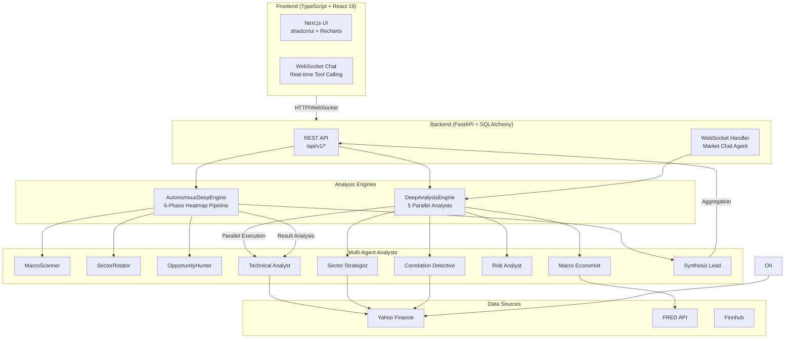
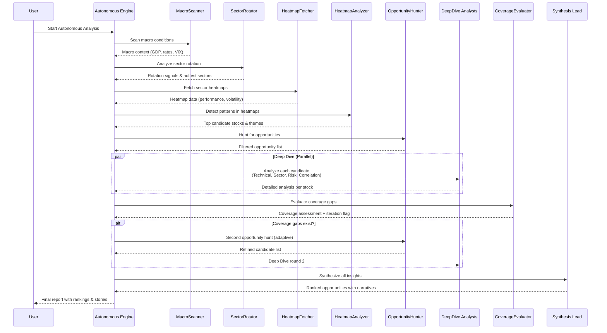

# 

# Teletraan

> **AI-Powered Market Intelligence Platform**
> Autonomous deep market analysis with multi-agent AI and heatmap-driven discovery

<div align="center">

[](https://www.python.org/downloads/)
[](https://fastapi.tiangolo.com/)
[](https://nextjs.org/)
[](https://github.com/anthropics/anthropic-sdk-python)
[](LICENSE)

</div>

## Overview

Teletraan is a full-stack AI market analysis platform that combines cutting-edge multi-agent AI reasoning with real-time financial data to autonomously discover market opportunities. Rather than requiring users to specify what to analyze, Teletraan **actively scouts global markets** using a sophisticated 6-phase pipeline: scanning macro conditions, rotating through sectors dynamically, hunting for opportunities, diving deep into candidates, evaluating coverage gaps adaptively, and synthesizing insights.

The platform features a **heatmap-driven stock discovery system** powered by Claude's Agent SDK for multi-agent reasoning, a **real-time WebSocket chat interface** with tool-calling capabilities, and a modern TypeScript/React frontend with interactive analysis dashboards.

## Features

- 🤖 **Multi-Agent Deep Analysis** — Five specialist analysts (Macro Economist, Sector Strategist, Technical Analyst, Risk Analyst, Correlation Detective) run in parallel, synthesized by a Lead Agent
- 🗺️ **Heatmap-Driven Stock Discovery** — Dynamic sector heatmap analysis identifies emerging opportunities autonomously
- 🔄 **Adaptive Coverage Loop** — Iterative refinement (up to 2 cycles) to fill analysis gaps and validate coverage
- 💬 **Real-Time Chat with Tool Calling** — WebSocket-based conversational analysis with 10 market data tools
- 📊 **Autonomous 5-Phase Pipeline** — MacroScanner → SectorRotator → OpportunityHunter → DeepDive → SynthesisLead
- 🌍 **Sector-Wide Analysis** — Multi-sector rotation with automated stock selection and ranking
- ⏰ **ETL Scheduler** — Background data ingestion via APScheduler with multi-source adapters (Yahoo Finance, FRED, Finnhub)

## Architecture




## Quick Start

### Prerequisites

- **Python 3.11+** with `uv` package manager
- **Node.js 18+** with `npm`
- **Git**

### Installation & Running

1. **Clone the repository**
   ```bash
   git clone https://github.com/yourusername/teletraan.git
   cd teletraan
   ```

2. **Start both services** (one command)
   ```bash
   ./start.sh
   ```

   Or with custom ports:
   ```bash
   BACKEND_PORT=8001 FRONTEND_PORT=3001 ./start.sh
   ```

3. **Open browser**
   ```
   Frontend: http://localhost:3000
   API Docs: http://localhost:8000/docs
   ```

The `start.sh` script handles:
- Installing Python and Node.js dependencies
- Creating `.env` files with defaults
- Starting both backend and frontend
- Waiting for services to be ready
- Opening your browser automatically

## Tech Stack

| Layer | Technology | Purpose |
|-------|-----------|---------|
| **Backend** | Python 3.11+ | Core runtime |
| | FastAPI | REST API + WebSocket |
| | SQLAlchemy + aiosqlite | Async database ORM |
| | Claude Agent SDK | Multi-agent LLM orchestration |
| | yfinance, fredapi | Market data adapters |
| | APScheduler | Background ETL jobs |
| | Pydantic v2 | Data validation |
| **Frontend** | TypeScript 5 | Type-safe frontend code |
| | Next.js 16 (App Router) | Full-stack React framework |
| | React 19 | UI component framework |
| | TanStack Query v5 | Server state management |
| | shadcn/ui | Headless component library |
| | Tailwind CSS 4 | Utility-first styling |
| | Recharts | Interactive charts & visualizations |
| **Database** | SQLite | Lightweight persistent storage |
| **Hosting** | Any ASGI/Node.js server | Production-ready |

## Analysis Pipeline

Teletraan's autonomous 6-phase analysis pipeline (heatmap-driven discovery):



### Pipeline Phases

1. **MacroScanner** — Global macro scan: GDP growth, interest rates, VIX, inflation expectations
2. **SectorRotator** — Sector rotation analysis: identify strongest and weakest sectors
3. **HeatmapFetcher** — Dynamic heatmap: sector performance, volatility, trend strength
4. **HeatmapAnalyzer** — LLM-driven pattern detection in heatmap data
5. **OpportunityHunter** — Stock screening with technical filters and opportunity scoring
6. **DeepDive** — Parallel deep analysis of selected stocks (5 specialist analysts)
7. **CoverageEvaluator** — Assess coverage quality; trigger adaptive loop if needed (max 2 iterations)
8. **SynthesisLead** — Final ranking, narrative generation, and insight compilation

## Project Structure

```
teletraan/
├── backend/
│   ├── main.py                           # FastAPI entry point
│   ├── pyproject.toml                    # Python dependencies
│   ├── api/
│   │   ├── routes/                       # REST API endpoints
│   │   ├── exceptions.py                 # Custom error handlers
│   │   └── schemas.py                    # Pydantic request/response models
│   ├── analysis/
│   │   ├── autonomous_engine.py          # 6-phase heatmap pipeline
│   │   ├── analysis_engine.py            # Basic technical analysis
│   │   ├── deep_analysis_engine.py       # Multi-agent orchestration
│   │   ├── agents/                       # Individual analyst modules
│   │   │   ├── macro_scanner.py
│   │   │   ├── sector_rotator.py
│   │   │   ├── opportunity_hunter.py
│   │   │   ├── heatmap_fetcher.py
│   │   │   ├── heatmap_analyzer.py
│   │   │   ├── technical_analyst.py
│   │   │   ├── sector_strategist.py
│   │   │   ├── macro_economist.py
│   │   │   ├── risk_analyst.py
│   │   │   ├── correlation_detective.py
│   │   │   ├── coverage_evaluator.py
│   │   │   └── synthesis_lead.py
│   │   ├── context_builder.py            # Market context construction
│   │   └── memory_service.py             # Institutional memory store
│   ├── llm/
│   │   └── market_agent.py               # Chat agent with tool calling
│   ├── models/
│   │   ├── deep_insight.py               # DeepInsight ORM model
│   │   ├── analysis_task.py              # AnalysisTask ORM model
│   │   └── ...                           # Other domain models
│   ├── data/
│   │   ├── adapters/                     # Data source integrations
│   │   └── market_data.py                # Data fetching utilities
│   ├── database.py                       # SQLAlchemy async setup
│   ├── config.py                         # Settings management
│   └── scheduler.py                      # APScheduler orchestration
│
├── frontend/
│   ├── package.json                      # npm dependencies
│   ├── next.config.ts                    # Next.js configuration
│   ├── tailwind.config.ts                # Tailwind CSS config
│   ├── app/
│   │   ├── layout.tsx                    # Root layout
│   │   ├── page.tsx                      # Home page (insights dashboard)
│   │   ├── chat/
│   │   │   └── page.tsx                  # Chat interface
│   │   └── api/
│   │       └── chat/                     # Chat endpoint
│   ├── components/
│   │   ├── ui/                           # shadcn/ui components
│   │   ├── insights/                     # Insight-specific components
│   │   └── charts/                       # Data visualization components
│   ├── lib/
│   │   ├── api.ts                        # Typed fetch utilities
│   │   ├── hooks/                        # Custom React hooks
│   │   │   ├── use-analysis-task.ts
│   │   │   ├── use-deep-insights.ts
│   │   │   └── use-chat.ts
│   │   └── types.ts                      # Shared TypeScript types
│   └── public/
│       └── teletraan-hero.png            # Hero image
│
├── start.sh                              # One-command startup script
├── CLAUDE.md                             # Developer guidance (architecture, patterns)
└── README.md                             # This file
```

## Configuration

### Backend Environment Variables

Create `backend/.env` (auto-created by `start.sh`):

| Variable | Default | Description |
|----------|---------|-------------|
| `DATABASE_URL` | `sqlite+aiosqlite:///./data/market-analyzer.db` | SQLite async connection string |
| `FRED_API_KEY` | *(optional)* | Federal Reserve Economic Data API key for macro data |
| `FINNHUB_API_KEY` | *(optional)* | Finnhub API key for enhanced data sources |

### Frontend Environment Variables

Create `frontend/.env.local` (auto-created by `start.sh`):

| Variable | Default | Description |
|----------|---------|-------------|
| `NEXT_PUBLIC_API_URL` | `http://localhost:8000` | Backend REST API base URL |
| `NEXT_PUBLIC_WS_URL` | `ws://localhost:8000/api/v1/chat` | WebSocket endpoint for chat |

## API Endpoints

### REST API (v1)

All endpoints prefixed with `/api/v1/`:

- `GET /health` — Health check
- `GET /insights` — List all deep insights
- `POST /analysis/autonomous` — Start autonomous analysis
- `GET /analysis/{task_id}` — Get analysis task status
- `GET /docs` — Interactive Swagger API documentation

### WebSocket

- `ws://localhost:8000/api/v1/chat` — Real-time chat with tool calling

## Development

### Backend Commands

```bash
cd backend
uv sync                                    # Install dependencies
uv run uvicorn main:app --reload           # Run dev server with hot reload
uv run pytest                              # Run all tests
uv run pytest tests/test_foo.py::test_bar  # Run specific test
```

### Frontend Commands

```bash
cd frontend
npm install                                # Install dependencies
npm run dev                                # Start dev server (http://localhost:3000)
npm run build                              # Production build
npm run lint                               # ESLint
npx playwright test                        # Run E2E tests
npx playwright test -g "test name"         # Run specific test
```

### Database

SQLite at `backend/data/market-analyzer.db`. Auto-created on first startup via `init_db()`. Schema defined via SQLAlchemy models in `backend/models/`.

To reset database:
```bash
rm backend/data/market-analyzer.db
# Restart backend to recreate
```

## Key Architectural Patterns

### Singletons

Module-level instances with `get_*()` factory functions:
```python
from analysis.autonomous_engine import get_autonomous_deep_engine
engine = get_autonomous_deep_engine()
```

### Naming Conventions

- **Backend**: `snake_case` for modules and functions
- **Frontend**: `kebab-case` for components, `use-*` prefix for hooks
- **Frontend path alias**: `@/*` maps to project root (e.g., `@/components/ui/card`)

### ORM & Database

- **SQLAlchemy**: `DeclarativeBase`, `mapped_column()`, `Mapped[]` for type hints
- **Pydantic v2**: `model_validate()` for ORM → schema conversion
- **Timestamps**: `TimestampMixin` adds `created_at` and `updated_at` automatically

### Error Handling

Custom exceptions with registered FastAPI handlers:
```python
from api.exceptions import NotFoundError, ValidationError, DataSourceError
```

### Agent Prompts

Each analyst has:
- System prompt constant (e.g., `TECHNICAL_ANALYST_PROMPT`)
- `format_*_context()` function to build LLM context
- `parse_*_response()` function to extract structured results

## Documentation

- **[CLAUDE.md](CLAUDE.md)** — Developer guidance: architecture, design patterns, commands, key modules
- **[API.md](API.md)** — Detailed REST API and WebSocket endpoint documentation
- **[ARCHITECTURE.md](ARCHITECTURE.md)** — Deep dive into analysis engines and agent design
- **[frontend/FRONTEND.md](frontend/FRONTEND.md)** — Frontend component library and hooks guide

## Contributing

Contributions are welcome! Please:

1. Fork the repository
2. Create a feature branch (`git checkout -b feature/amazing-feature`)
3. Commit your changes (`git commit -m 'Add amazing feature'`)
4. Push to the branch (`git push origin feature/amazing-feature`)
5. Open a Pull Request

## License

Teletraan is licensed under the **MIT License**. See [LICENSE](LICENSE) for details.

---

<div align="center">

**Built with ❤️ using FastAPI, Next.js, and Claude Agent SDK**

[Report Bug](https://github.com/yourusername/teletraan/issues) · [Request Feature](https://github.com/yourusername/teletraan/issues) · [View Demo](https://teletraan-demo.example.com)

</div>
