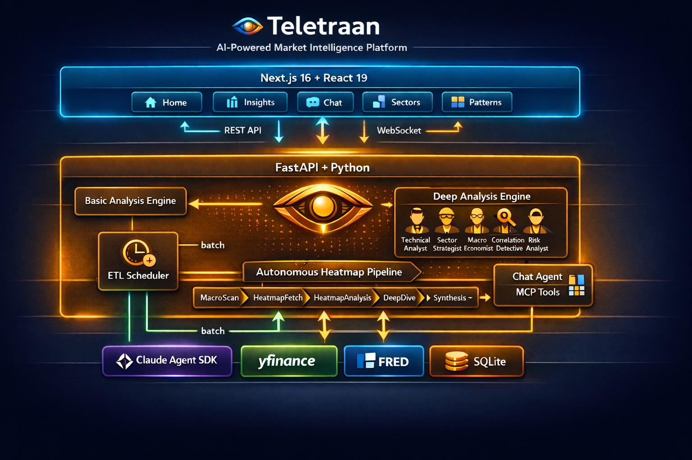
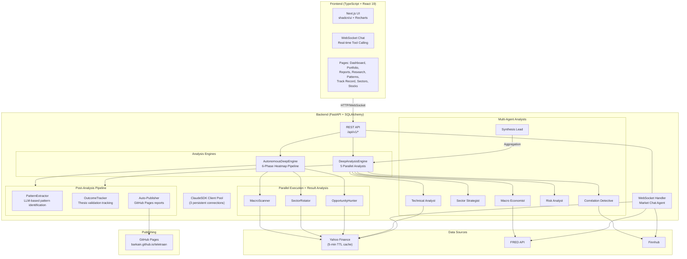
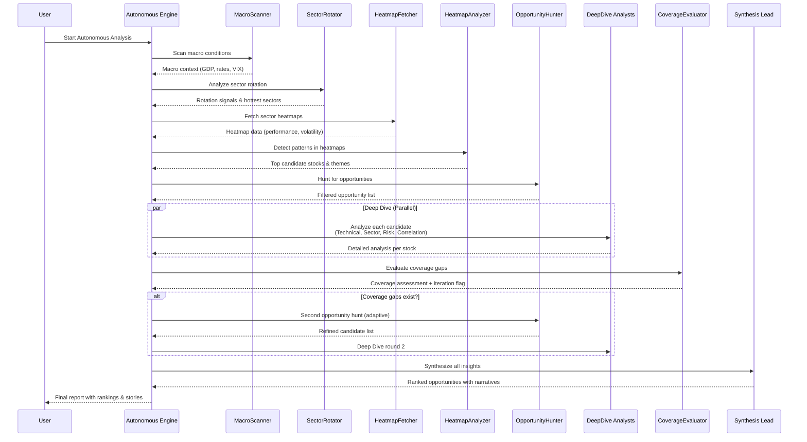

# 

# Teletraan

> **AI-Powered Market Intelligence Platform**
> Autonomous deep market analysis with multi-agent AI, portfolio tracking, pattern recognition, and published reports

<div align="center">

[](https://www.python.org/downloads/)
[](https://fastapi.tiangolo.com/)
[](https://nextjs.org/)
[](https://github.com/anthropics/anthropic-sdk-python)
[](LICENSE)

</div>

## Overview

Teletraan is a full-stack AI market analysis platform that combines cutting-edge multi-agent AI reasoning with real-time financial data to autonomously discover market opportunities. Rather than requiring users to specify what to analyze, Teletraan **actively scouts global markets** using a sophisticated 6-phase pipeline: scanning macro conditions, rotating through sectors dynamically, hunting for opportunities, diving deep into candidates, evaluating coverage gaps adaptively, and synthesizing insights.

The platform features a **heatmap-driven stock discovery system** powered by Claude's Agent SDK for multi-agent reasoning, a **real-time WebSocket chat interface** with tool-calling capabilities, and a modern TypeScript/React frontend with interactive analysis dashboards.

## Features

### Core Analysis
- **Multi-Agent Deep Analysis** — Five specialist analysts (Macro Economist, Sector Strategist, Technical Analyst, Risk Analyst, Correlation Detective) run in parallel via `asyncio.gather()`, synthesized by a Lead Agent
- **Heatmap-Driven Stock Discovery** — Dynamic sector heatmap analysis identifies emerging opportunities autonomously
- **Adaptive Coverage Loop** — Iterative refinement (up to 2 cycles) to fill analysis gaps and validate coverage
- **Autonomous 6-Phase Pipeline** — MacroScanner, SectorRotator, OpportunityHunter, DeepDive, CoverageEvaluator, SynthesisLead
- **Real-Time Chat with Tool Calling** — WebSocket-based conversational analysis with 10 market data tools

### Portfolio Management
- **Portfolio Tracking** — CRUD operations for holdings with live price enrichment via Yahoo Finance
- **Insight Impact Analysis** — Automatically matches active insights against portfolio holdings to surface bullish/bearish exposure
- **Portfolio-Aware Discovery** — Autonomous pipeline loads holdings, ensures held symbols get deep-dived, and synthesis mentions portfolio exposure

### Pattern Recognition
- **LLM-Based Pattern Extraction** — Identifies repeatable trading patterns (technical setups, macro correlations, sector rotations, etc.) from insights and conversations
- **Pattern Merging** — Automatically deduplicates similar patterns using Jaccard similarity on trigger conditions and expected outcomes
- **Quality Validation** — Ensures patterns have measurable trigger conditions and specific, testable expected outcomes

### Track Record
- **Prediction Outcome Tracking** — Automatically starts tracking when insights are generated, monitors price movements, and evaluates thesis validation
- **Monthly Trend Analysis** — Per-month aggregated success rate statistics with lookback periods up to 36 months
- **Pattern Success Rate Updates** — Validated outcomes feed back into pattern success rates for continuous learning

### Research Hub
- **Follow-Up Research** — Spawn focused research from conversations targeting specific questions (sector deep-dives, correlation analysis, risk scenarios, technical focus, macro impact)
- **Background Execution** — Research runs asynchronously via FastAPI BackgroundTasks with status tracking (pending, running, completed, cancelled)
- **Parent-Child Linking** — Research results are linked to parent insights and conversations for full provenance

### Reports & Publishing
- **Persistent Reports** — Completed analysis tasks are stored as reports with full insight details, phases completed, and market regime context
- **Self-Contained HTML** — Reports render as dark-themed, fully portable HTML pages with all CSS inlined
- **GitHub Pages Auto-Publishing** — Reports auto-publish to the `gh-pages` branch after analysis completes; manual publish also available
- **Published Reports**: [https://barkain.github.io/teletraan/](https://barkain.github.io/teletraan/)

### Infrastructure
- **ETL Scheduler** — Background data ingestion via APScheduler with multi-source adapters (Yahoo Finance, FRED, Finnhub)
- **ClaudeSDK Client Pool** — 3 persistent LLM connections replacing per-call subprocess spawns for dramatically lower latency
- **yfinance TTL Cache** — 5-minute cache for batch downloads and market caps, eliminating redundant API calls
- **ThreadPoolExecutor** — 8-worker thread pool for parallel market cap fetching in heatmap analysis
- **FD Limit Raised** — Soft file descriptor limit raised to 4096 to handle concurrent subprocess + connection load
- **Auto-Migration** — `database.py` auto-detects and adds missing columns on startup via `ALTER TABLE ADD COLUMN`

## Architecture





## Quick Start

### Prerequisites

- **Python 3.11+** with `uv` package manager
- **Node.js 18+** with `npm`
- **Git**

### Installation & Running

1. **Clone the repository**
   ```bash
   git clone https://github.com/yourusername/teletraan.git
   cd teletraan
   ```

2. **Start both services** (one command)
   ```bash
   ./start.sh
   ```

   Or with custom ports:
   ```bash
   BACKEND_PORT=8001 FRONTEND_PORT=3001 ./start.sh
   ```

3. **Open browser**
   ```
   Frontend: http://localhost:3000
   API Docs: http://localhost:8000/docs
   ```

The `start.sh` script handles:
- Installing Python and Node.js dependencies
- Creating `.env` files with defaults
- Starting both backend and frontend
- Waiting for services to be ready
- Opening your browser automatically

## Tech Stack

| Layer | Technology | Purpose |
|-------|-----------|---------|
| **Backend** | Python 3.11+ | Core runtime |
| | FastAPI | REST API + WebSocket |
| | SQLAlchemy + aiosqlite | Async database ORM |
| | Claude Agent SDK | Multi-agent LLM orchestration |
| | yfinance, fredapi | Market data adapters |
| | APScheduler | Background ETL jobs |
| | Pydantic v2 | Data validation |
| **Frontend** | TypeScript 5 | Type-safe frontend code |
| | Next.js 16 (App Router) | Full-stack React framework |
| | React 19 | UI component framework |
| | TanStack Query v5 | Server state management |
| | shadcn/ui | Headless component library |
| | Tailwind CSS 4 | Utility-first styling |
| | Recharts | Interactive charts & visualizations |
| **Database** | SQLite | Lightweight persistent storage |
| **Publishing** | GitHub Pages | Auto-published analysis reports |
| **Hosting** | Any ASGI/Node.js server | Production-ready |

## Analysis Pipeline

Teletraan's autonomous 6-phase analysis pipeline (heatmap-driven discovery):



### Pipeline Phases

1. **MacroScanner** — Global macro scan: GDP growth, interest rates, VIX, inflation expectations
2. **SectorRotator** — Sector rotation analysis: identify strongest and weakest sectors
3. **HeatmapFetcher** — Dynamic heatmap: sector performance, volatility, trend strength
4. **HeatmapAnalyzer** — LLM-driven pattern detection in heatmap data
5. **OpportunityHunter** — Stock screening with technical filters and opportunity scoring
6. **DeepDive** — Parallel deep analysis of selected stocks (5 specialist analysts)
7. **CoverageEvaluator** — Assess coverage quality; trigger adaptive loop if needed (max 2 iterations)
8. **SynthesisLead** — Final ranking, narrative generation, and insight compilation

## Project Structure

```
teletraan/
├── backend/
│   ├── main.py                           # FastAPI entry point (FD limit, logging)
│   ├── pyproject.toml                    # Python dependencies
│   ├── api/
│   │   ├── routes/                       # REST API endpoints
│   │   │   ├── analysis.py               # Basic analysis endpoints
│   │   │   ├── chat.py                   # WebSocket chat handler
│   │   │   ├── deep_insights.py          # Autonomous & deep analysis
│   │   │   ├── portfolio.py              # Portfolio CRUD + impact analysis
│   │   │   ├── reports.py                # Report listing + GitHub Pages publishing
│   │   │   ├── research.py               # Follow-up research management
│   │   │   ├── knowledge.py              # Patterns, themes, track record
│   │   │   ├── outcomes.py               # Insight outcome tracking
│   │   │   ├── insight_conversations.py  # Conversational insight exploration
│   │   │   ├── stocks.py                 # Stock data endpoints
│   │   │   └── ...                       # health, search, settings, export
│   │   ├── exceptions.py                 # Custom error handlers
│   │   └── schemas/                      # Pydantic request/response models
│   ├── analysis/
│   │   ├── autonomous_engine.py          # 6-phase heatmap pipeline (portfolio-aware)
│   │   ├── deep_engine.py                # Multi-agent orchestration
│   │   ├── engine.py                     # Basic technical analysis
│   │   ├── pattern_extractor.py          # LLM-based pattern extraction
│   │   ├── outcome_tracker.py            # Prediction outcome tracking
│   │   ├── followup_research.py          # Follow-up research launcher
│   │   ├── agents/                       # Individual analyst modules
│   │   │   ├── macro_scanner.py
│   │   │   ├── sector_rotator.py
│   │   │   ├── opportunity_hunter.py
│   │   │   ├── heatmap_fetcher.py        # 5-min TTL cache, ThreadPoolExecutor
│   │   │   ├── heatmap_analyzer.py
│   │   │   ├── technical_analyst.py
│   │   │   ├── sector_strategist.py
│   │   │   ├── macro_economist.py
│   │   │   ├── risk_analyst.py
│   │   │   ├── correlation_detective.py
│   │   │   ├── coverage_evaluator.py
│   │   │   └── synthesis_lead.py
│   │   ├── context_builder.py            # Market context construction
│   │   └── memory_service.py             # Institutional memory store
│   ├── llm/
│   │   ├── market_agent.py               # Chat agent with tool calling
│   │   └── client_pool.py                # ClaudeSDK persistent connection pool
│   ├── models/
│   │   ├── deep_insight.py               # DeepInsight ORM model
│   │   ├── analysis_task.py              # AnalysisTask ORM model
│   │   ├── portfolio.py                  # Portfolio + PortfolioHolding
│   │   ├── knowledge_pattern.py          # KnowledgePattern (validated patterns)
│   │   ├── insight_outcome.py            # InsightOutcome (thesis tracking)
│   │   ├── insight_conversation.py       # Conversations + FollowUpResearch
│   │   ├── conversation_theme.py         # ConversationTheme
│   │   └── ...                           # stock, price, economic, settings
│   ├── data/
│   │   ├── adapters/                     # Data source integrations
│   │   └── market_data.py                # Data fetching utilities
│   ├── database.py                       # SQLAlchemy async setup + auto-migration
│   ├── config.py                         # Settings management
│   └── scheduler/
│       └── etl.py                        # APScheduler: prices, outcomes, memory
│
├── frontend/
│   ├── package.json                      # npm dependencies
│   ├── next.config.ts                    # Next.js configuration
│   ├── app/
│   │   ├── layout.tsx                    # Root layout with navigation
│   │   ├── page.tsx                      # Home page (insights dashboard)
│   │   ├── chat/page.tsx                 # Chat interface
│   │   ├── portfolio/page.tsx            # Portfolio holdings + impact
│   │   ├── reports/page.tsx              # Report listing
│   │   ├── reports/[id]/page.tsx         # Report detail view
│   │   ├── research/page.tsx             # Research hub
│   │   ├── patterns/page.tsx             # Pattern recognition
│   │   ├── track-record/page.tsx         # Prediction track record
│   │   ├── sectors/page.tsx              # Sector analysis
│   │   ├── stocks/page.tsx               # Stock explorer
│   │   ├── stocks/[symbol]/page.tsx      # Individual stock view
│   │   ├── insights/page.tsx             # Insight listing
│   │   ├── insights/[id]/page.tsx        # Insight detail + conversation
│   │   ├── conversations/page.tsx        # Conversation listing
│   │   ├── signals/page.tsx              # Market signals
│   │   └── settings/page.tsx             # Application settings
│   ├── components/
│   │   ├── ui/                           # shadcn/ui components
│   │   ├── insights/                     # Insight-specific components
│   │   ├── charts/                       # Data visualization components
│   │   ├── portfolio/                    # Portfolio components
│   │   │   ├── holdings-table.tsx
│   │   │   ├── holding-dialog.tsx
│   │   │   ├── portfolio-summary.tsx
│   │   │   └── portfolio-impact.tsx
│   │   ├── research/                     # Research components
│   │   │   ├── research-list.tsx
│   │   │   ├── research-detail.tsx
│   │   │   ├── research-status-badge.tsx
│   │   │   └── research-type-badge.tsx
│   │   └── ...                           # layout, search, export, stocks
│   ├── lib/
│   │   ├── api.ts                        # Typed fetch utilities
│   │   ├── hooks/                        # Custom React hooks
│   │   │   ├── use-portfolio.ts
│   │   │   ├── use-reports.ts
│   │   │   ├── use-research.ts
│   │   │   ├── use-track-record.ts
│   │   │   ├── use-analysis-task.ts
│   │   │   ├── use-deep-insights.ts
│   │   │   ├── use-chat.ts
│   │   │   └── ...                       # 16 hooks total
│   │   └── types.ts                      # Shared TypeScript types
│   └── public/
│       └── teletraan-hero.png            # Hero image
│
├── start.sh                              # One-command startup script
├── CLAUDE.md                             # Developer guidance (architecture, patterns)
└── README.md                             # This file
```

## Configuration

### Backend Environment Variables

Create `backend/.env` (auto-created by `start.sh`):

| Variable | Default | Description |
|----------|---------|-------------|
| `DATABASE_URL` | `sqlite+aiosqlite:///./data/market-analyzer.db` | SQLite async connection string |
| `FRED_API_KEY` | *(optional)* | Federal Reserve Economic Data API key for macro data |
| `FINNHUB_API_KEY` | *(optional)* | Finnhub API key for enhanced data sources |

### Frontend Environment Variables

Create `frontend/.env.local` (auto-created by `start.sh`):

| Variable | Default | Description |
|----------|---------|-------------|
| `NEXT_PUBLIC_API_URL` | `http://localhost:8000` | Backend REST API base URL |
| `NEXT_PUBLIC_WS_URL` | `ws://localhost:8000/api/v1/chat` | WebSocket endpoint for chat |

## API Endpoints

### REST API (v1)

All endpoints prefixed with `/api/v1/`:

**Analysis**
- `POST /deep-insights/autonomous` — Start autonomous analysis pipeline
- `GET /deep-insights/{task_id}/status` — Get analysis task status
- `GET /deep-insights` — List deep insights (paginated)

**Portfolio**
- `GET /portfolio` — Get portfolio with enriched holdings (live prices, gain/loss, allocation)
- `POST /portfolio` — Create portfolio
- `POST /portfolio/holdings` — Add holding
- `PUT /portfolio/holdings/{id}` — Update holding
- `DELETE /portfolio/holdings/{id}` — Delete holding
- `GET /portfolio/impact` — Analyze insight impact on portfolio holdings

**Reports**
- `GET /reports` — List completed analysis reports (paginated)
- `GET /reports/{task_id}` — Get full report with insights
- `GET /reports/{task_id}/html` — Get self-contained HTML report
- `POST /reports/{task_id}/publish` — Publish report to GitHub Pages

**Research**
- `GET /research` — List follow-up research (filterable by status/type)
- `GET /research/{id}` — Get research details
- `POST /research` — Create and launch follow-up research
- `DELETE /research/{id}` — Cancel pending/running research

**Knowledge & Track Record**
- `GET /knowledge/patterns` — List validated patterns (filterable)
- `GET /knowledge/patterns/matching` — Get patterns matching current market conditions
- `GET /knowledge/patterns/{id}` — Get specific pattern
- `GET /knowledge/themes` — List conversation themes
- `GET /knowledge/track-record` — Get insight accuracy statistics
- `GET /knowledge/track-record/monthly-trend` — Get monthly success rate trend

**Outcomes**
- `POST /outcomes/start` — Start tracking an insight's prediction
- `GET /outcomes` — List tracked outcomes
- `POST /outcomes/check` — Check and update all active trackers
- `GET /outcomes/summary` — Get tracking summary statistics

**Other**
- `GET /health` — Health check
- `GET /docs` — Interactive Swagger API documentation

### WebSocket

- `ws://localhost:8000/api/v1/chat` — Real-time chat with tool calling

## Development

### Backend Commands

```bash
cd backend
uv sync                                    # Install dependencies
uv run uvicorn main:app --reload           # Run dev server with hot reload
uv run pytest                              # Run all tests
uv run pytest tests/test_foo.py::test_bar  # Run specific test
```

### Frontend Commands

```bash
cd frontend
npm install                                # Install dependencies
npm run dev                                # Start dev server (http://localhost:3000)
npm run build                              # Production build
npm run lint                               # ESLint
npx playwright test                        # Run E2E tests
npx playwright test -g "test name"         # Run specific test
```

### Database

SQLite at `backend/data/market-analyzer.db`. Auto-created on first startup via `init_db()`. Schema defined via SQLAlchemy models in `backend/models/`. Missing columns are auto-migrated on startup via `ALTER TABLE ADD COLUMN`.

Key tables: `deep_insights`, `analysis_tasks`, `portfolios`, `portfolio_holdings`, `knowledge_patterns`, `insight_outcomes`, `insight_conversations`, `follow_up_research`, `conversation_themes`, `stocks`, `price_history`, `economic_indicators`

To reset database:
```bash
rm backend/data/market-analyzer.db
# Restart backend to recreate
```

## Key Architectural Patterns

### Singletons

Module-level instances with `get_*()` factory functions:
```python
from analysis.autonomous_engine import get_autonomous_deep_engine
engine = get_autonomous_deep_engine()
```

### Naming Conventions

- **Backend**: `snake_case` for modules and functions
- **Frontend**: `kebab-case` for components, `use-*` prefix for hooks
- **Frontend path alias**: `@/*` maps to project root (e.g., `@/components/ui/card`)

### ORM & Database

- **SQLAlchemy**: `DeclarativeBase`, `mapped_column()`, `Mapped[]` for type hints
- **Pydantic v2**: `model_validate()` for ORM → schema conversion
- **Timestamps**: `TimestampMixin` adds `created_at` and `updated_at` automatically

### Error Handling

Custom exceptions with registered FastAPI handlers:
```python
from api.exceptions import NotFoundError, ValidationError, DataSourceError
```

### Agent Prompts

Each analyst has:
- System prompt constant (e.g., `TECHNICAL_ANALYST_PROMPT`)
- `format_*_context()` function to build LLM context
- `parse_*_response()` function to extract structured results

### LLM Client Pool

`llm/client_pool.py` manages a pool of 3 persistent `ClaudeSDKClient` instances, replacing per-call subprocess spawns. Clients are created lazily on first checkout and reused across queries.

### Post-Analysis Pipeline

After synthesis completes in both `AutonomousDeepEngine` and `DeepAnalysisEngine`:
1. **PatternExtractor** runs LLM analysis on each insight to identify repeatable patterns
2. **OutcomeTracker** starts tracking predictions for insights with primary symbols
3. **Auto-Publisher** generates HTML and pushes to `gh-pages` branch (autonomous engine only)

### Auto-Migration

`database.py` includes `_sync_migrate_missing_columns()` which compares SQLAlchemy model columns against existing SQLite tables on startup and issues `ALTER TABLE ADD COLUMN` for any gaps. This eliminates the need for manual schema migrations during development.

### Data Caching

`heatmap_fetcher.py` implements a module-level TTL cache (5-minute expiry) for yfinance data. Batch downloads and market cap fetches are cached with keys based on sorted symbol lists. Market cap fetching uses a `ThreadPoolExecutor(max_workers=8)` for parallel execution.

## Documentation

- **[CLAUDE.md](CLAUDE.md)** — Developer guidance: architecture, design patterns, commands, key modules
- **Swagger UI** — Interactive API docs at `http://localhost:8000/docs` when running

## Contributing

Contributions are welcome! Please:

1. Fork the repository
2. Create a feature branch (`git checkout -b feature/amazing-feature`)
3. Commit your changes (`git commit -m 'Add amazing feature'`)
4. Push to the branch (`git push origin feature/amazing-feature`)
5. Open a Pull Request

## License

Teletraan is licensed under the **MIT License**. See [LICENSE](LICENSE) for details.

---

<div align="center">

**Built with ❤️ using FastAPI, Next.js, and Claude Agent SDK**

[Report Bug](https://github.com/yourusername/teletraan/issues) · [Request Feature](https://github.com/yourusername/teletraan/issues) · [View Demo](https://teletraan-demo.example.com)

</div>
