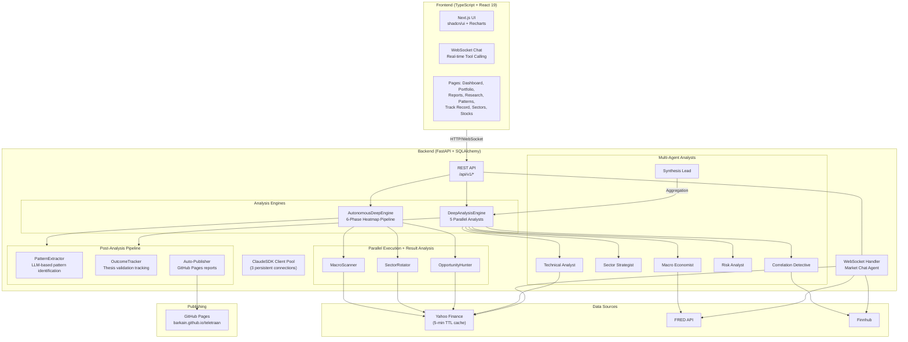
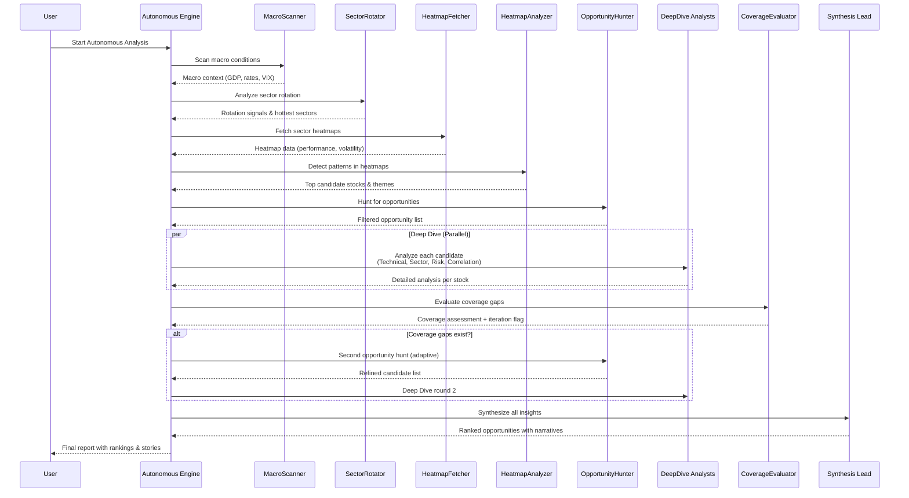

# Architecture

Teletraan is a full-stack AI market analysis platform: **FastAPI** backend + **Next.js 16** frontend.

## System Diagram




## Tech Stack

| Layer | Technology | Purpose |
|-------|-----------|---------|
| **Backend** | Python 3.11+ | Core runtime |
| | FastAPI | REST API + WebSocket |
| | SQLAlchemy + aiosqlite | Async database ORM |
| | Claude Agent SDK | Multi-agent LLM orchestration |
| | yfinance, fredapi | Market data adapters |
| | APScheduler | Background ETL jobs |
| | Pydantic v2 | Data validation |
| **Frontend** | TypeScript 5 | Type-safe frontend code |
| | Next.js 16 (App Router) | Full-stack React framework |
| | React 19 | UI component framework |
| | TanStack Query v5 | Server state management |
| | shadcn/ui | Headless component library |
| | Tailwind CSS 4 | Utility-first styling |
| | Recharts | Interactive charts & visualizations |
| **Database** | SQLite | Lightweight persistent storage |
| **Publishing** | GitHub Pages | Auto-published analysis reports |

## Analysis Pipeline

Teletraan's autonomous 6-phase analysis pipeline (heatmap-driven discovery):



### Pipeline Phases

1. **MacroScanner** -- Global macro scan: GDP growth, interest rates, VIX, inflation expectations
2. **SectorRotator** -- Sector rotation analysis: identify strongest and weakest sectors
3. **HeatmapFetcher** -- Dynamic heatmap: sector performance, volatility, trend strength
4. **HeatmapAnalyzer** -- LLM-driven pattern detection in heatmap data
5. **OpportunityHunter** -- Stock screening with technical filters and opportunity scoring
6. **DeepDive** -- Parallel deep analysis of selected stocks (5 specialist analysts)
7. **CoverageEvaluator** -- Assess coverage quality; trigger adaptive loop if needed (max 2 iterations)
8. **SynthesisLead** -- Final ranking, narrative generation, and insight compilation

## Analysis Engines

The platform includes three analysis engines:

- **AnalysisEngine** -- Basic technical analysis
- **DeepAnalysisEngine** -- Multi-agent deep analysis (5 specialist analysts run in parallel via `asyncio.gather()`, then a Synthesis Lead aggregates)
- **AutonomousDeepEngine** -- Self-guided 6-phase pipeline: MacroScanner, SectorRotator, OpportunityHunter, DeepDive, CoverageEvaluator, SynthesisLead (portfolio-aware)

### Post-Analysis Pipeline

After synthesis completes in both `AutonomousDeepEngine` and `DeepAnalysisEngine`:
1. **PatternExtractor** runs LLM analysis on each insight to identify repeatable patterns
2. **OutcomeTracker** starts tracking predictions for insights with primary symbols
3. **Auto-Publisher** generates HTML and pushes to `gh-pages` branch (autonomous engine only)

## Key Architectural Patterns

### Singletons

Module-level instances with `get_*()` factory functions:
```python
from analysis.autonomous_engine import get_autonomous_deep_engine
engine = get_autonomous_deep_engine()
```

### Naming Conventions

- **Backend**: `snake_case` for modules and functions
- **Frontend**: `kebab-case` for components, `use-*` prefix for hooks
- **Frontend path alias**: `@/*` maps to project root (e.g., `@/components/ui/card`)

### ORM & Database

- **SQLAlchemy**: `DeclarativeBase`, `mapped_column()`, `Mapped[]` for type hints
- **Pydantic v2**: `model_validate()` for ORM to schema conversion
- **Timestamps**: `TimestampMixin` adds `created_at` and `updated_at` automatically

### Error Handling

Custom exceptions with registered FastAPI handlers:
```python
from api.exceptions import NotFoundError, ValidationError, DataSourceError
```

### Agent Prompts

Each analyst has:
- System prompt constant (e.g., `TECHNICAL_ANALYST_PROMPT`)
- `format_*_context()` function to build LLM context
- `parse_*_response()` function to extract structured results

### LLM Client Pool

`llm/client_pool.py` manages a pool of 3 persistent `ClaudeSDKClient` instances, replacing per-call subprocess spawns. Clients are created lazily on first checkout and reused across queries.

### Auto-Migration

`database.py` includes `_sync_migrate_missing_columns()` which compares SQLAlchemy model columns against existing SQLite tables on startup and issues `ALTER TABLE ADD COLUMN` for any gaps. This eliminates the need for manual schema migrations during development.

### Data Caching

`heatmap_fetcher.py` implements a module-level TTL cache (5-minute expiry) for yfinance data. Batch downloads and market cap fetches are cached with keys based on sorted symbol lists. Market cap fetching uses a `ThreadPoolExecutor(max_workers=8)` for parallel execution.

## Database

SQLite at `backend/data/market-analyzer.db`. Auto-created on first startup via `init_db()`. Schema defined via SQLAlchemy models in `backend/models/`. Missing columns are auto-migrated on startup via `ALTER TABLE ADD COLUMN`.

Key tables: `deep_insights`, `analysis_tasks`, `portfolios`, `portfolio_holdings`, `knowledge_patterns`, `insight_outcomes`, `insight_conversations`, `follow_up_research`, `conversation_themes`, `stocks`, `price_history`, `economic_indicators`

To reset database:
```bash
rm backend/data/market-analyzer.db
# Restart backend to recreate
```

## Models

- `deep_insight.py` -- DeepInsight
- `analysis_task.py` -- AnalysisTask
- `portfolio.py` -- Portfolio + PortfolioHolding
- `knowledge_pattern.py` -- KnowledgePattern (validated trading patterns)
- `insight_outcome.py` -- InsightOutcome (thesis tracking)
- `insight_conversation.py` -- InsightConversation + FollowUpResearch
- `conversation_theme.py` -- ConversationTheme
- `stock.py`, `price.py`, `economic.py`, `indicator.py`, `settings.py`

## Project Structure

```
teletraan/
├── backend/
│   ├── main.py                           # FastAPI entry point (FD limit, logging)
│   ├── pyproject.toml                    # Python dependencies
│   ├── api/
│   │   ├── routes/                       # REST API endpoints
│   │   │   ├── analysis.py               # Basic analysis endpoints
│   │   │   ├── chat.py                   # WebSocket chat handler
│   │   │   ├── deep_insights.py          # Autonomous & deep analysis
│   │   │   ├── portfolio.py              # Portfolio CRUD + impact analysis
│   │   │   ├── reports.py                # Report listing + GitHub Pages publishing
│   │   │   ├── research.py               # Follow-up research management
│   │   │   ├── knowledge.py              # Patterns, themes, track record
│   │   │   ├── outcomes.py               # Insight outcome tracking
│   │   │   ├── insight_conversations.py  # Conversational insight exploration
│   │   │   ├── stocks.py                 # Stock data endpoints
│   │   │   └── ...                       # health, search, settings, export
│   │   ├── exceptions.py                 # Custom error handlers
│   │   └── schemas/                      # Pydantic request/response models
│   ├── analysis/
│   │   ├── autonomous_engine.py          # 6-phase heatmap pipeline (portfolio-aware)
│   │   ├── deep_engine.py                # Multi-agent orchestration
│   │   ├── engine.py                     # Basic technical analysis
│   │   ├── pattern_extractor.py          # LLM-based pattern extraction
│   │   ├── outcome_tracker.py            # Prediction outcome tracking
│   │   ├── followup_research.py          # Follow-up research launcher
│   │   ├── agents/                       # Individual analyst modules
│   │   │   ├── macro_scanner.py
│   │   │   ├── sector_rotator.py
│   │   │   ├── opportunity_hunter.py
│   │   │   ├── heatmap_fetcher.py        # 5-min TTL cache, ThreadPoolExecutor
│   │   │   ├── heatmap_analyzer.py
│   │   │   ├── technical_analyst.py
│   │   │   ├── sector_strategist.py
│   │   │   ├── macro_economist.py
│   │   │   ├── risk_analyst.py
│   │   │   ├── correlation_detective.py
│   │   │   ├── coverage_evaluator.py
│   │   │   └── synthesis_lead.py
│   │   ├── context_builder.py            # Market context construction
│   │   └── memory_service.py             # Institutional memory store
│   ├── llm/
│   │   ├── market_agent.py               # Chat agent with tool calling
│   │   └── client_pool.py                # ClaudeSDK persistent connection pool
│   ├── models/
│   │   ├── deep_insight.py               # DeepInsight ORM model
│   │   ├── analysis_task.py              # AnalysisTask ORM model
│   │   ├── portfolio.py                  # Portfolio + PortfolioHolding
│   │   ├── knowledge_pattern.py          # KnowledgePattern (validated patterns)
│   │   ├── insight_outcome.py            # InsightOutcome (thesis tracking)
│   │   ├── insight_conversation.py       # Conversations + FollowUpResearch
│   │   ├── conversation_theme.py         # ConversationTheme
│   │   └── ...                           # stock, price, economic, settings
│   ├── data/
│   │   ├── adapters/                     # Data source integrations
│   │   └── market_data.py                # Data fetching utilities
│   ├── database.py                       # SQLAlchemy async setup + auto-migration
│   ├── config.py                         # Settings management
│   └── scheduler/
│       └── etl.py                        # APScheduler: prices, outcomes, memory
│
├── frontend/
│   ├── package.json                      # npm dependencies
│   ├── next.config.ts                    # Next.js configuration
│   ├── app/
│   │   ├── layout.tsx                    # Root layout with navigation
│   │   ├── page.tsx                      # Home page (insights dashboard)
│   │   ├── chat/page.tsx                 # Chat interface
│   │   ├── portfolio/page.tsx            # Portfolio holdings + impact
│   │   ├── reports/page.tsx              # Report listing
│   │   ├── reports/[id]/page.tsx         # Report detail view
│   │   ├── research/page.tsx             # Research hub
│   │   ├── patterns/page.tsx             # Pattern recognition
│   │   ├── track-record/page.tsx         # Prediction track record
│   │   ├── sectors/page.tsx              # Sector analysis
│   │   ├── stocks/page.tsx               # Stock explorer
│   │   ├── stocks/[symbol]/page.tsx      # Individual stock view
│   │   ├── insights/page.tsx             # Insight listing
│   │   ├── insights/[id]/page.tsx        # Insight detail + conversation
│   │   ├── conversations/page.tsx        # Conversation listing
│   │   ├── signals/page.tsx              # Market signals
│   │   └── settings/page.tsx             # Application settings
│   ├── components/
│   │   ├── ui/                           # shadcn/ui components
│   │   ├── insights/                     # Insight-specific components
│   │   ├── charts/                       # Data visualization components
│   │   ├── portfolio/                    # Portfolio components
│   │   ├── research/                     # Research components
│   │   └── ...                           # layout, search, export, stocks
│   ├── lib/
│   │   ├── api.ts                        # Typed fetch utilities
│   │   ├── hooks/                        # Custom React hooks (16 hooks)
│   │   └── types.ts                      # Shared TypeScript types
│   └── public/
│       └── teletraan-hero.png            # Hero image
│
├── start.sh                              # One-command startup script
├── CLAUDE.md                             # Developer guidance
└── README.md                             # Project overview
```

## Infrastructure

- **ETL Scheduler** -- Background data ingestion via APScheduler with multi-source adapters (Yahoo Finance, FRED, Finnhub)
- **ClaudeSDK Client Pool** -- 3 persistent LLM connections replacing per-call subprocess spawns for dramatically lower latency
- **yfinance TTL Cache** -- 5-minute cache for batch downloads and market caps, eliminating redundant API calls
- **ThreadPoolExecutor** -- 8-worker thread pool for parallel market cap fetching in heatmap analysis
- **FD Limit Raised** -- Soft file descriptor limit raised to 4096 to handle concurrent subprocess + connection load
- **Auto-Migration** -- `database.py` auto-detects and adds missing columns on startup via `ALTER TABLE ADD COLUMN`
